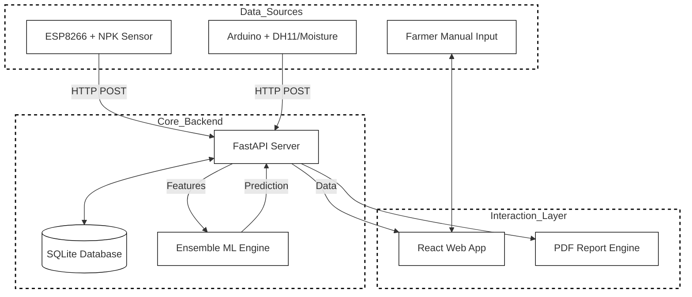
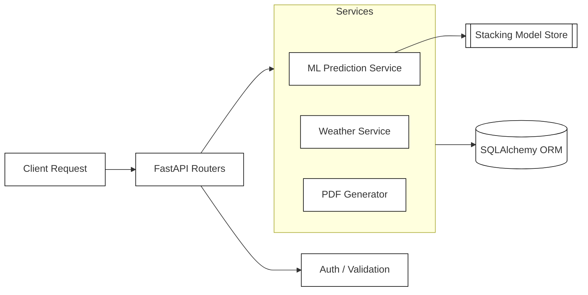
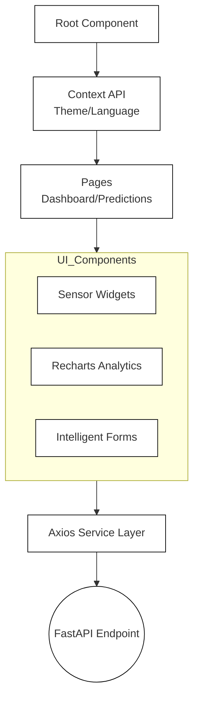

# Soil Health & Intelligent Crop Recommendation System

<p align="center">
  
</p>

<p align="center">
  
  
  
  
  
  
</p>

---

##  Overview
The **Soil Health & Intelligent Crop Recommendation System** is a cutting-edge Agricultural IoT solution designed to empower farmers with data-driven insights. By combining real-time sensor data with high-precision machine learning models, the system offers personalized crop suggestions, fertilizer strategies, and detailed soil analysis.

###  Key Features
- ** Real-time IoT Monitoring**: Integration with NPK sensors, DHT11, and Capacitive Moisture sensors for live soil auditing.
- ** Stacking Ensemble Intelligence**: High-accuracy predictions using a meta-learner architecture (RF, GB, XGB, SVM).
- ** Professional Reporting**: Automated generation of bilingual (English/Kannada) PDF soil health reports.
- ** Interactive Dashboard**: Modern React-based UI with live gauges, historical trends, and farm visualization.
- ** Smart Weather Integration**: Hyper-local weather forecasting and historical climate analysis.

---

##  System Architecture

### 1. High-Level Data Flow


### 2. Backend Architecture (FastAPI Engine)
The backend is built for speed and modularity, managing the bridge between hardware and intelligence.


### 3. Frontend Architecture (React Ecosystem)
A component-based architecture designed for high responsiveness and accessibility.


---

##  Technology Stack
| Layer | Technologies |
|---|---|
| **Frontend** | React, Vite, Recharts, Framer Motion, CSS3 |
| **Backend** | FastAPI, Python 3.10, SQLAlchemy, Pydantic |
| **Machine Learning** | Scikit-Learn, XGBoost, CatBoost, Joblib |
| **IoT/Hardware** | Arduino UNO R4, ESP8266, RS485 NPK Sensor, DHT11 |
| **Database** | SQLite |

---

## Quick Start

### 1. Environment Setup
Clone the repository and create a virtual environment:
```bash
git clone https://github.com/guruprasad908/soil-health-analysis-and-crop-recommendation-system-using-IOT.git
cd soil-crop-recommender
python -m venv venv
source venv/bin/activate  # venv\Scripts\activate on Windows
```

### 2. Install Dependencies
```bash
pip install -r requirements.txt
cd frontend && npm install
```

### 3. Launch the System
**Backend:**
```bash
python start_backend.py
```
**Frontend:**
```bash
npm run dev
```

---

##  License
This project is licensed under the MIT License - see the [LICENSE](LICENSE) file for details.

---

##  Academic Project
This system was developed as a **Major Project for Sustainable Agriculture** as part of final year academics (2025 - 2026).

##  Contributing
We are constantly looking for ways to improve this system! Whether it's adding support for more soil types, integrating satellite data, or improving the ML models, your contributions are welcome.

1. Fork the Project
2. Create your Feature Branch (`git checkout -b feature/AmazingFeature`)
3. Commit your Changes (`git commit -m 'Add some AmazingFeature'`)
4. Push to the Branch (`git push origin feature/AmazingFeature`)
5. Open a Pull Request

##  Contact & Socials
Feel free to reach out for collaborations or queries:

[](mailto:guruprasadpujari78@gmail.com)
[](https://www.instagram.com/guruprasad__pj/#)

---
<p align="center">Developed with ❤️ for Sustainable Agriculture</p>
