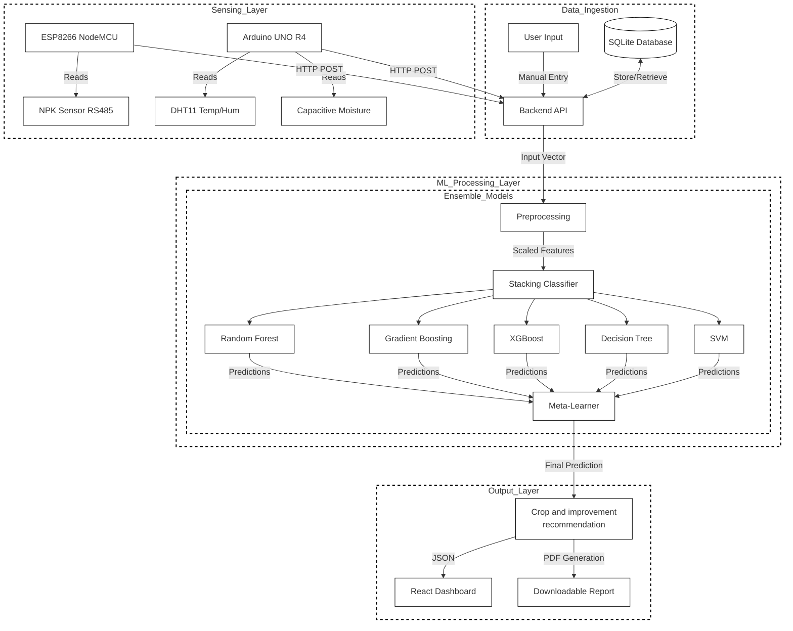

# Soil Health & Intelligent Crop Recommendation System

## 1. System Overview
This project is an advanced Agricultural IoT solutions designed to assist farmers in maximizing crop yield and maintaining soil health. It integrates **Real-time IoT Sensors**, **Machine Learning**, and a **Modern Web Interface** to provide accurate crop recommendations, fertilizer advisory, and market insights.

---

## 2. High-Level System Architecture

The following diagram illustrates the complete end-to-end data flow:



---

## 3. Architecture Diagram Explanation

### A. Data Ingestion & Sensing Layer (Top Section)
The system collects input data from two primary sources:
1.  **Sensing Layer (IoT)**: Real-time environmental data acquisition.
    *   **ESP8266 NodeMCU**: Reads from the NPK Sensor (Nitrogen, Phosphorus, Potassium) and transmits data via Wi-Fi.
    *   **Arduino UNO R4**: Collects reading from the DHT11 (Temperature/Humidity) and Capacitive Moisture sensors.
2.  **Data Ingestion**: Handles manual inputs and data persistence.
    *   **User Input**: Farmers can manually enter or adjust values via the React Dashboard.
    *   **SQLite Database**: Acts as the central reservoir, storing historical sensor logs and user profiles.
    *   **Backend API**: The FastAPI server unifies these streams, accepting HTTP POST requests from both IoT devices and the Web UI.

### B. Machine Learning Processing Layer (Middle Section)
This is the system's intelligence core, employing a **Stacking Ensemble** technique.
1.  **Preprocessing**: Raw data (N, P, K, pH, etc.) is standardized using a `StandardScaler` to ensure consistency.
2.  **Base Models (Level-0)**: The processed vector is fed into five diverse algorithms simultaneously:
    *   *Random Forest & Decision Tree*: Capture complex non-linear patterns.
    *   *Gradient Boosting & XGBoost*: Excel at structured tabular data.
    *   *SVM*: Effective in high-dimensional feature spaces.
3.  **Meta-Learner (Level-1)**: A **Logistic Regression** model aggregates predictions from all base models. It "learns" which model is most reliable for a given soil type, producing a final, highly accurate prediction.

### C. Output Layer (Bottom Section)
The actionable insights generated by the model are delivered to the user:
1.  **Final Recommendation**: The system outputs the optimal crop (e.g., "Rice") along with a confidence score and soil health improvement tips.
2.  **React Dashboard**: Displays the result instantly with interactive charts and gauges.
3.  **PDF Generation**: A comprehensive, downloadable report is created for the farmer, containing the diagnosis, fertilizer schedule, and market advice.

---

## 4. Key Technologies
*   **Language**: Python 3.10+, JavaScript (ES6+), C++ (Arduino).
*   **Frontend**: React, Vite, Recharts, CSS Modules.
*   **Backend**: FastAPI, Uvicorn, SQLAlchemy.
*   **Machine Learning**: Scikit-Learn, XGBoost, Pandas, Joblib.
*   **Hardware**: Arduino, ESP8266, DHT22, Capacitive Moisture Sensor.

---

## 5. How to Run (Quick Start)

**1. Backend**
```bash
cd soil_crop_recommender
python -m venv venv
# Activate venv
pip install -r requirements.txt
python start_backend.py
```

**2. Frontend**
```bash
cd frontend
npm install
npm run dev
```

**3. Hardware**
*   Upload `Arduino/arduino_wifi_firmware.ino` to Arduino UNO R4.
*   Upload `NodeMCU ESP8266/nodemcu_and_npk_code.ino` to NodeMCU.
