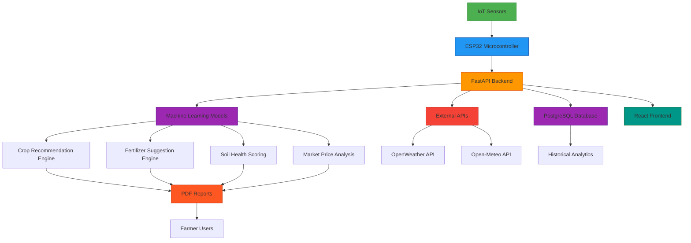
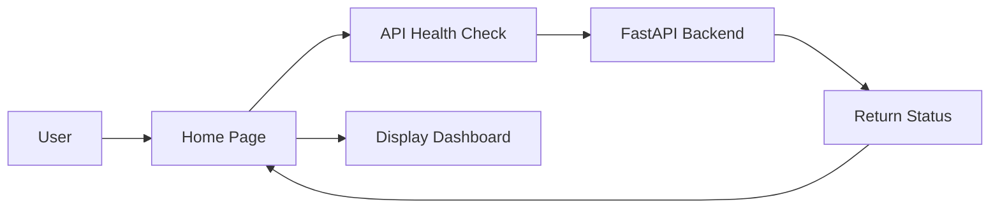
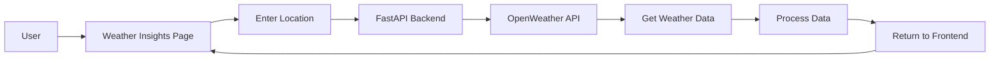
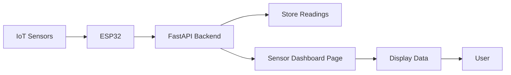
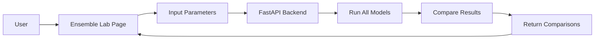
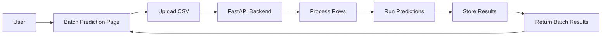
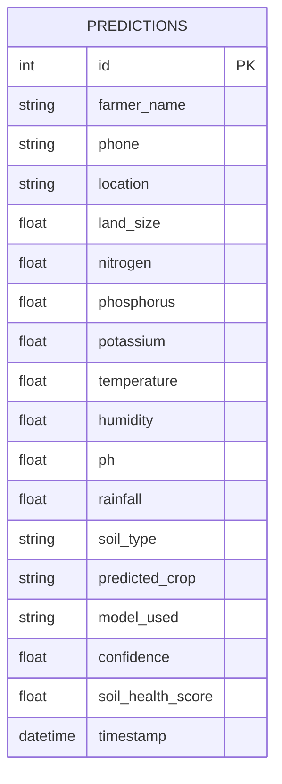
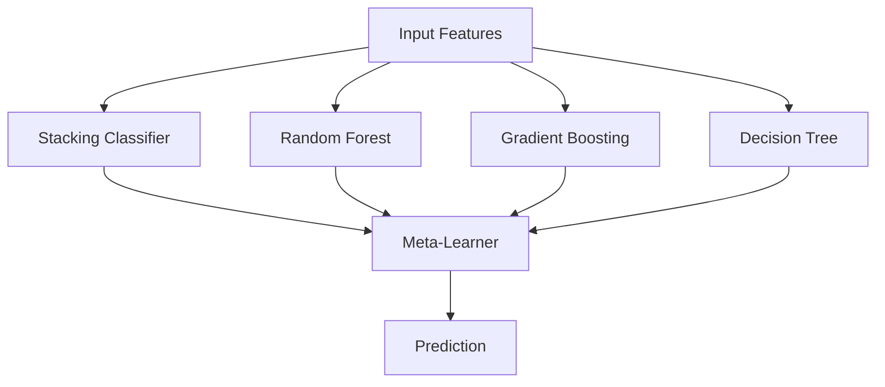
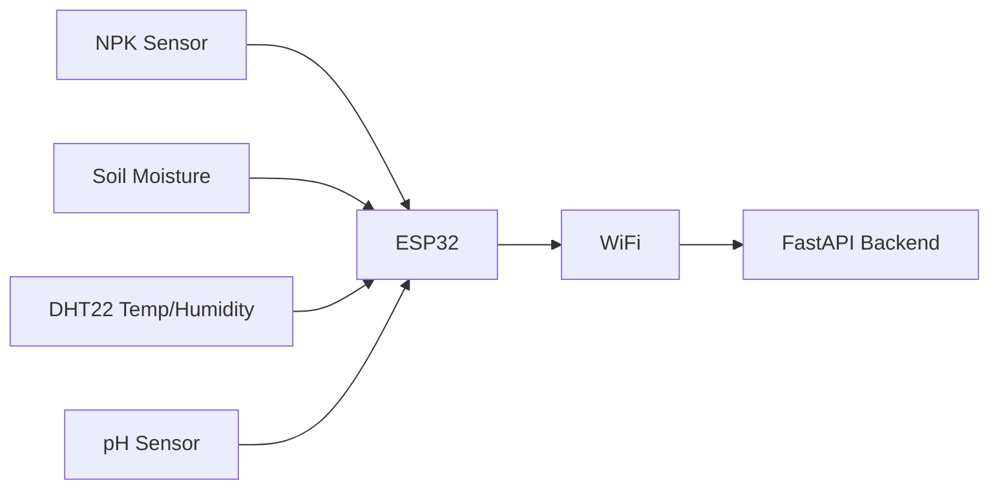

# 🌾 Soil Health & Crop Recommendation System - Project Implementation Guide

## 📋 Table of Contents

- [Project Overview](#-project-overview)
- [System Architecture](#-system-architecture)
- [Feature Implementations](#-feature-implementations)
  - [Home Page](#home-page)
  - [Crop Recommendation](#crop-recommendation)
  - [Weather Insights](#weather-insights)
  - [Sensor Dashboard](#sensor-dashboard)
  - [Ensemble Lab](#ensemble-lab)
  - [Batch Prediction](#batch-prediction)
  - [Fertilizer Guide](#fertilizer-guide)
  - [Bio Fertilizer Guide](#bio-fertilizer-guide)
  - [History](#history)
- [Technology Stack](#-technology-stack)
- [Database Schema](#-database-schema)
- [API Endpoints](#-api-endpoints)
- [Machine Learning Models](#-machine-learning-models)
- [Hardware Integration](#-hardware-integration)

## 🎯 Project Overview

The Soil Health & Crop Recommendation System is a comprehensive agricultural decision support system that provides intelligent crop recommendations, fertilizer suggestions, and soil health analysis based on real-time soil data and environmental conditions.

### Key Components

1. **IoT Soil Sensors**: Real-time monitoring of NPK levels, soil moisture, temperature, and humidity
2. **ESP32 Microcontroller**: Wireless data transmission from field sensors to cloud backend
3. **FastAPI Backend**: High-performance REST API for data processing and ML predictions
4. **PostgreSQL Database**: Secure storage of farmer data, predictions, and historical records
5. **React Frontend**: Modern, responsive user interface with multilingual support
6. **OpenWeather API**: Real-time weather data integration for accurate predictions
7. **PDF Report Generation**: Professional advisory reports with embedded visualizations
8. **Fertilizer Recommendation Engine**: Crop-specific nutrient management suggestions

## 🏗️ System Architecture

## ⚙️ Feature Implementations

### Home Page

#### Frontend Implementation
- **File**: `frontend/src/pages/Home.jsx`
- **Components**: 
  - Welcome banner with project overview
  - Quick access feature cards
  - System status indicators
  - Recent predictions summary
- **State Management**: 
  - Uses ThemeContext for dark/light mode
  - Uses LanguageContext for internationalization
- **API Integration**: 
  - Fetches system health status from backend
  - Retrieves recent prediction statistics

#### Backend Implementation
- **Endpoint**: `GET /`
- **File**: `app/main.py` (Lines 211-213)
- **Functionality**: 
  - Returns system health status
  - Provides basic API connectivity check
- **Database**: No database interaction
- **Services**: None

#### Architecture Flow

### Crop Recommendation

#### Frontend Implementation
- **File**: `frontend/src/pages/Prediction.jsx`
- **Components**:
  - Soil parameter input form (N, P, K, pH, temperature, humidity, rainfall)
  - Soil type selection dropdown
  - Farmer information fields
  - Model selection dropdown
  - Climate data auto-fetch popup
  - Prediction results display
  - Soil health visualization charts
- **State Management**:
  - Form state for input parameters
  - Result state for prediction outcomes
  - Loading/error states
  - Climate popup state management
- **API Integration**:
  - `POST /predict` for crop recommendations
  - `GET /models` for available models
  - `GET /weather-history-free` for climate data fetching

#### Backend Implementation
- **Endpoints**: 
  - `POST /predict`
  - `GET /models`
  - `GET /weather-history-free`
- **Files**: 
  - `app/main.py` (Lines 261-437)
  - `app/services/weather_service.py`
- **Functionality**:
  - Validates input parameters
  - Encodes soil type using LabelEncoder
  - Selects and runs ML model
  - Calculates soil health score
  - Generates fertilizer recommendations
  - Stores results in database
  - Generates PDF reports
- **Database**: 
  - Inserts prediction record into `predictions` table
- **Services**:
  - Weather service for climate data
  - Soil health scorer for health assessment
  - Fertilizer advisor for recommendations
  - PDF generator for report creation

#### Architecture Flow

### Weather Insights

#### Frontend Implementation
- **File**: `frontend/src/pages/Weather.jsx`
- **Components**:
  - Location search with autocomplete
  - Current weather display
  - 5-day forecast visualization
  - Historical weather charts
  - Weather alerts and warnings
- **State Management**:
  - Location search state
  - Current weather data
  - Forecast data
  - Loading/error states
- **API Integration**:
  - `GET /weather` for current conditions
  - `GET /weather-forecast` for forecasts
  - `GET /weather-history-free` for historical data

#### Backend Implementation
- **Endpoints**:
  - `GET /weather`
  - `GET /weather-forecast`
  - `GET /weather-history`
  - `GET /weather-history-free`
- **Files**:
  - `app/main.py` (Lines 253-258, 586-658)
  - `app/services/weather_service.py`
- **Functionality**:
  - Fetches current weather from OpenWeather API
  - Retrieves 5-day forecasts
  - Provides historical weather data
  - Implements free Open-Meteo API as backup
- **Database**: No direct database interaction
- **Services**:
  - Weather service for API integration
  - Reverse geocoding for location names

#### Architecture Flow

### Sensor Dashboard

#### Frontend Implementation
- **File**: `frontend/src/pages/SensorDashboard.jsx`
- **Components**:
  - Real-time NPK readings display
  - Historical sensor data charts
  - Sensor status indicators
  - Data export functionality
- **State Management**:
  - Real-time sensor data
  - Historical data for charts
  - Connection status
- **API Integration**:
  - `GET /npk-dashboard` for sensor data
  - `POST /npk-reading` for receiving sensor data

#### Backend Implementation
- **Endpoints**:
  - `POST /npk-reading`
  - `GET /npk-dashboard`
- **Files**:
  - `app/main.py` (Lines 1085-1128)
- **Functionality**:
  - Receives sensor data from ESP32
  - Stores recent readings in memory
  - Provides dashboard data to frontend
  - Calculates averages and trends
- **Database**: In-memory storage (last 100 readings)
- **Services**: None

#### Architecture Flow

### Ensemble Lab

#### Frontend Implementation
- **File**: `frontend/src/pages/ModelComparison.jsx`
- **Components**:
  - Model selection interface
  - Side-by-side prediction comparison
  - Confidence score visualization
  - Feature importance analysis
- **State Management**:
  - Input parameters
  - Comparison results from all models
  - Selected model for detailed view
- **API Integration**:
  - `POST /compare-models` for model comparisons
  - `POST /explain-prediction` for feature importance

#### Backend Implementation
- **Endpoints**:
  - `POST /compare-models`
  - `POST /explain-prediction`
- **Files**:
  - `app/main.py` (Lines 448-483, 661-726)
- **Functionality**:
  - Runs predictions using all available models
  - Compares confidence scores
  - Provides feature importance analysis
  - Identifies consensus predictions
- **Database**: No database interaction
- **Services**: None

#### Architecture Flow

### Batch Prediction

#### Frontend Implementation
- **File**: `frontend/src/pages/BatchPrediction.jsx`
- **Components**:
  - CSV file upload interface
  - Batch processing progress indicator
  - Results table with success/failure status
  - Export functionality for results
- **State Management**:
  - File upload state
  - Processing status
  - Results data
- **API Integration**:
  - `POST /batch-predict` for CSV processing

#### Backend Implementation
- **Endpoints**:
  - `POST /batch-predict`
- **Files**:
  - `app/main.py` (Lines 524-583)
- **Functionality**:
  - Processes uploaded CSV files
  - Validates required columns
  - Runs predictions for each row
  - Handles errors gracefully
  - Returns batch results
- **Database**: No direct database interaction (predictions stored individually)
- **Services**: None

#### Architecture Flow

### Fertilizer Guide

#### Frontend Implementation
- **File**: `frontend/src/pages/FertilizerGuide.jsx`
- **Components**:
  - Comprehensive fertilizer database
  - Search and filter functionality
  - Detailed fertilizer information cards
  - Application guidelines
- **State Management**:
  - Fertilizer data
  - Search/filter parameters
- **API Integration**: None (static data)

#### Backend Implementation
- **Endpoints**: None
- **Files**: Static content only
- **Functionality**: Informational content display
- **Database**: None
- **Services**: None

#### Architecture Flow

### Bio Fertilizer Guide

#### Frontend Implementation
- **File**: `frontend/src/pages/BioFertilizerGuide.jsx`
- **Components**:
  - Bio-fertilizer categories
  - Detailed product information
  - Usage instructions
  - Benefits and applications
- **State Management**:
  - Bio-fertilizer data
  - Active category selection
- **API Integration**: None (static data)

#### Backend Implementation
- **Endpoints**: None
- **Files**: Static content only
- **Functionality**: Informational content display
- **Database**: None
- **Services**: None

#### Architecture Flow

### History

#### Frontend Implementation
- **File**: `frontend/src/pages/History.jsx`
- **Components**:
  - Prediction history table
  - Search and filter by farmer/phone
  - Detailed prediction view
  - Export functionality
- **State Management**:
  - History data
  - Filter parameters
  - Selected prediction details
- **API Integration**:
  - `GET /history` for prediction records
  - `GET /export` for data export

#### Backend Implementation
- **Endpoints**:
  - `GET /history`
  - `GET /export`
- **Files**:
  - `app/main.py` (Lines 485-521, 728-791)
- **Functionality**:
  - Retrieves prediction history from database
  - Filters by farmer name or phone
  - Exports data in CSV/Excel formats
- **Database**: 
  - Queries `predictions` table
- **Services**: None

#### Architecture Flow

## 🧠 Technology Stack

### Backend
- **Framework**: FastAPI
- **Database**: PostgreSQL with SQLAlchemy ORM
- **ML Library**: scikit-learn
- **Serialization**: joblib
- **Environment**: python-dotenv
- **HTTP Client**: httpx

### Frontend
- **Framework**: React.js
- **Routing**: react-router-dom
- **State Management**: React Context API
- **Charts**: Chart.js with react-chartjs-2
- **Styling**: CSS Modules
- **Internationalization**: Custom i18n implementation

### Machine Learning
- **Models**: 
  - Random Forest Classifier
  - Gradient Boosting Classifier
  - Decision Tree Classifier
  - Stacking Classifier (Ensemble)
- **Preprocessing**: StandardScaler, LabelEncoder
- **Evaluation**: cross_val_score, accuracy_score

### Hardware
- **Microcontroller**: ESP32
- **Sensors**: 
  - NPK Sensor
  - Soil Moisture Sensor
  - DHT22 (Temperature/Humidity)
  - pH Sensor

## 🗃️ Database Schema

## 📡 API Endpoints

### Core Endpoints
- `GET /` - Health check endpoint
- `GET /models` - List available ML models with details
- `POST /predict` - Single crop prediction with comprehensive analysis
- `GET /download?farmer_name={name}` - Download PDF report

### Advanced Endpoints
- `POST /compare-models` - Compare predictions across all models
- `GET /history` - Retrieve prediction history with filtering
- `POST /batch-predict` - Process multiple predictions from CSV upload
- `GET /weather-forecast` - 7-day weather forecast data
- `POST /explain-prediction` - Feature importance explanation
- `GET /export` - Export data in CSV/Excel formats

### Weather Endpoints
- `GET /weather` - Current weather conditions
- `GET /weather-history` - Historical weather data
- `GET /weather-history-free` - Free Open-Meteo historical data

### Market Analysis Endpoints
- `GET /market-prices` - Current crop market prices
- `GET /price-trend` - Historical price trend analysis
- `GET /market-recommendation` - Market-based selling advice

### Sensor Endpoints
- `POST /npk-reading` - Receive NPK sensor data
- `GET /npk-dashboard` - Get sensor dashboard data

## 🤖 Machine Learning Models

### Model Architecture

### Model Performance
- **Stacking Classifier**: 99.55% accuracy
- **Random Forest**: 99.55% accuracy
- **Gradient Boosting**: 98.64% accuracy
- **Decision Tree**: 98.86% accuracy

### Features Used
1. Nitrogen (N) - 0-200 mg/kg
2. Phosphorus (P) - 0-200 mg/kg
3. Potassium (K) - 0-200 mg/kg
4. Temperature - -10 to 50°C
5. Humidity - 0-100%
6. pH - 3.0-10.0
7. Rainfall - 0-2000 mm
8. Soil Type - Encoded categorical variable

## 🔌 Hardware Integration

### Sensor Suite

### Data Transmission
- **Protocol**: HTTP POST
- **Format**: JSON
- **Frequency**: Every 5 minutes
- **Security**: HTTPS encryption
- **Error Handling**: Retry logic with exponential backoff

### ESP32 Firmware
- **Language**: Arduino C++
- **Libraries**: WiFi, HTTPClient, ArduinoJson
- **Functionality**: 
  - Read sensor values
  - Connect to WiFi
  - Send data to backend
  - Handle errors and retries