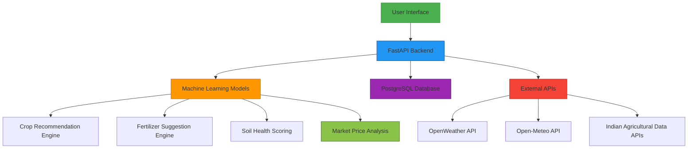
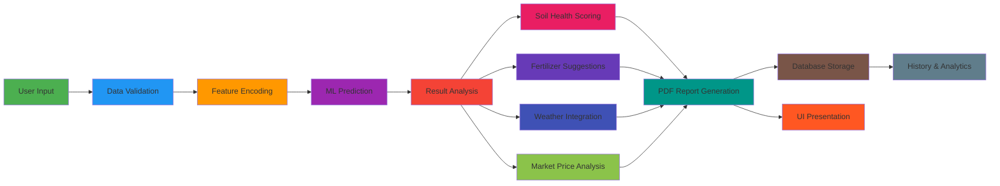
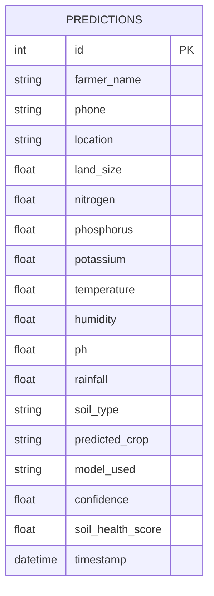

# Soil Crop Recommender System - Project Report

## 1. Project Overview

The Soil Crop Recommender System is an intelligent agricultural decision support system that provides farmers with crop recommendations, fertilizer suggestions, and soil health analysis based on soil parameters and environmental conditions. The system uses machine learning models to predict the most suitable crops for specific soil conditions and provides comprehensive advisory services.

## 2. System Architecture

## 3. Technology Stack

### Backend
- **Framework**: FastAPI (Python)
- **Database**: PostgreSQL with SQLAlchemy ORM
- **ML Libraries**: scikit-learn, pandas, numpy, joblib
- **Visualization**: matplotlib, reportlab
- **Templating**: jinja2

### Frontend
- **Framework**: React.js
- **Styling**: CSS3 with custom themes
- **Charts**: Chart.js with react-chartjs-2
- **State Management**: React Context API

### External Services
- **Weather Data**: OpenWeather API, Open-Meteo API
- **Geocoding**: OpenWeather Geocoding API, Open-Meteo Geocoding
- **Market Data**: Indian agricultural price APIs (data.gov.in, mandi rate services)

## 4. Data Flow Pipeline

## 5. Crop Recommendation Engine

### Machine Learning Models

The system implements multiple ML models for crop prediction:

1. **Stacking Classifier (Ensemble)**
   - Combines multiple base models
   - Highest accuracy: 99.55%
   - Default recommendation model

2. **Random Forest**
   - 150 decision trees
   - Accuracy: 99.55%
   - Good balance of accuracy and interpretability

3. **Gradient Boosting**
   - Sequential decision trees
   - Accuracy: 98.64%
   - Handles complex patterns well

4. **Decision Tree**
   - Single tree classifier
   - Accuracy: 98.86%
   - Highly interpretable

### Input Features

- **Soil Chemistry**: Nitrogen (N), Phosphorus (P), Potassium (K)
- **Soil Properties**: pH level, soil type
- **Environmental Conditions**: Temperature, humidity, rainfall
- **Location Data**: Geographical coordinates

## 6. Fertilizer Suggestion Engine

### Functionality

The fertilizer engine provides:

1. **NPK Analysis**
   - Current soil nutrient levels
   - Optimal ranges for recommended crops
   - Deficiency identification

2. **Recommendations**
   - Specific fertilizer quantities
   - Organic alternatives
   - Application timing suggestions

3. **Soil Treatment**
   - pH adjustment methods
   - Nutrient balancing techniques
   - Organic matter enhancement

## 7. Soil Health Scoring System

### Scoring Components

1. **Nitrogen Level** (15 points)
2. **Phosphorus Level** (12 points)
3. **Potassium Level** (13 points)
4. **pH Balance** (20 points)
5. **Nutrient Balance** (15 points)
6. **Temperature Suitability** (5 points)
7. **Humidity Suitability** (5 points)
8. **Rainfall Adequacy** (5 points)
9. **Soil Type Compatibility** (10 points)

### Score Categories

- **Excellent**: 80-100 points
- **Good**: 65-79 points
- **Fair**: 50-64 points
- **Poor**: 0-49 points

## 8. Market Price Analysis Engine

### Functionality

The market price engine provides:

1. **Current Market Prices**
   - Real-time crop prices from multiple markets
   - Price ranges across different locations
   - Best market identification

2. **Price Trends**
   - Historical price analysis
   - Trend direction (upward/downward/stable)
   - Seasonal pattern recognition

3. **Market Recommendations**
   - Optimal selling time suggestions
   - Market selection advice
   - Price forecasting

### Data Sources

1. **data.gov.in**: Official Indian agricultural price data
2. **Mandi Rate Services**: Regional market price information
3. **Commodity Exchanges**: Formal market data
4. **News Portals**: Price trend information

## 9. Weather Integration

### Current Weather
- Real-time temperature, humidity, rainfall
- Weather condition descriptions
- Wind speed and direction

### Forecast Data
- 5-day weather predictions
- Rainfall probability
- Temperature trends

### Historical Weather
- Past weather data analysis
- Seasonal pattern recognition
- Climate trend identification

## 10. PDF Report Generation

### Report Components

1. **Farmer Information**
2. **Soil Analysis**
3. **Crop Recommendation**
4. **Confidence Scores**
5. **Soil Health Assessment**
6. **Fertilizer Recommendations**
7. **Market Price Analysis**
8. **Weather Data**
9. **Visual Charts**

### Visualization Features

- Soil NPK level charts
- Soil health breakdown graphs
- Rainfall comparison charts
- Price trend charts
- Health indicator visuals

## 11. Database Schema

## 12. API Endpoints

### Core Endpoints
- `GET /` - Health check
- `GET /models` - Available ML models
- `POST /predict` - Crop prediction
- `GET /weather` - Current weather
- `GET /weather-forecast` - Weather forecast
- `GET /download` - PDF report download

### Advanced Endpoints
- `GET /weather-history` - Historical weather
- `POST /compare-models` - Model comparison
- `GET /history` - Prediction history
- `GET /export` - Data export (CSV/Excel)
- `POST /batch-predict` - Batch predictions

### Market Price Endpoints
- `GET /market-prices` - Current crop prices
- `GET /price-trend` - Price trend analysis
- `GET /market-recommendation` - Market-based recommendations

## 13. Deployment Architecture

### Development Environment
- **OS**: Windows 10/11
- **Python**: 3.9+
- **Node.js**: 14+
- **Database**: PostgreSQL

### Production Deployment
- **Platform**: Render.com
- **Containerization**: Docker (implied)
- **CI/CD**: Git-based deployment
- **Scaling**: Horizontal scaling support

## 14. Security Features

- **Input Validation**: Pydantic models with constraints
- **API Rate Limiting**: External service protection
- **Data Sanitization**: SQL injection prevention
- **Environment Variables**: Secure API key storage

## 15. Performance Optimization

- **Model Caching**: Pre-loaded ML models
- **Database Indexing**: Optimized queries
- **Async Operations**: Non-blocking I/O
- **Response Caching**: Frequently accessed data

## 16. Future Enhancements

1. **Mobile Application**: Native mobile apps
2. **IoT Integration**: Sensor data integration
3. **Disease Prediction**: Plant disease identification
4. **Irrigation Scheduling**: Automated irrigation planning
5. **Advanced Market Analytics**: Price forecasting models
6. **Multilingual Support**: Regional language interfaces

hey we need add a new feature and we need to buid a fertilizer recomendation engine i have dataset in the dataset folder what should we do now     