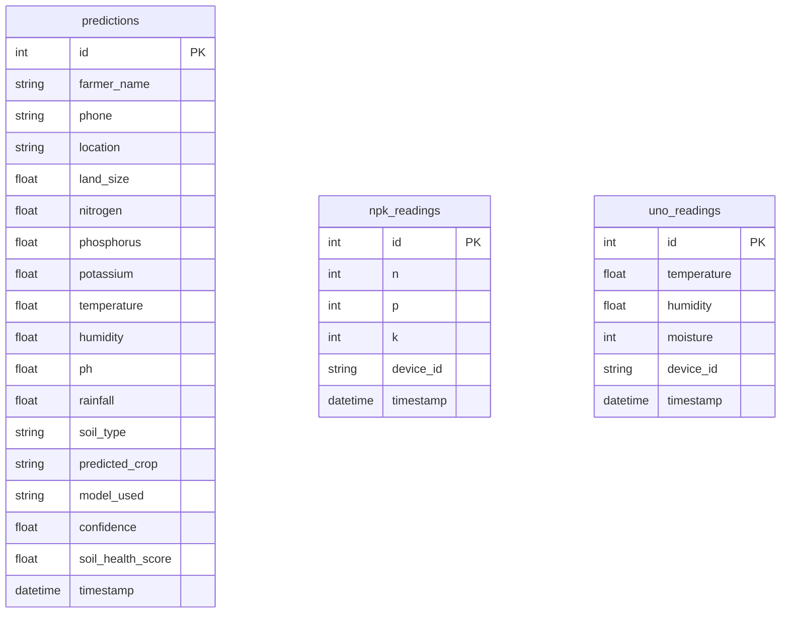

# Entity Relationship Diagram (ERD)

This document details the database schema for the Soil Crop Recommender System. The system uses a relational database (SQLite) with three primary tables.

## Schema Overview

The database is designed with **independent entities** to decouple sensor data collection from the user-driven prediction process.

1.  **`npk_readings`**: Stores high-frequency data from the ESP8266 (Nitrogen, Phosphorus, Potassium).
2.  **`uno_readings`**: Stores high-frequency data from the Arduino UNO (Temperature, Humidity, Moisture).
3.  **`predictions`**: Stores the historical record of every crop prediction made by users, including the snapshot of environmental conditions at that moment.

## Mermaid ER Diagram

## Table Descriptions

### 1. `predictions`
*   **Purpose**: The central audit trail for the application. It records every interaction where a user requested a crop recommendation.
*   **Key Fields**:
    *   `predicted_crop`: The output of the ML model (e.g., "Rice").
    *   `confidence`: The certainty score of the prediction (0-100%).
    *   `model_used`: Identifies which model version or ensemble was active.
    *   `timestamp`: When the prediction occurred.

### 2. `npk_readings`
*   **Purpose**: A time-series log of soil nutrient data.
*   **Source**: ESP8266 NodeMCU via RS485 NPK Sensor.
*   **Usage**: The dashboard fetches the latest record (ordered by timestamp desc) to show "Live Status".

### 3. `uno_readings`
*   **Purpose**: A time-series log of environmental data.
*   **Source**: Arduino UNO R4 WiFi via DHT11 and Capacitive Moisture Sensor.
*   **Usage**: Combined with NPK data to form the full input vector for the ML model.
