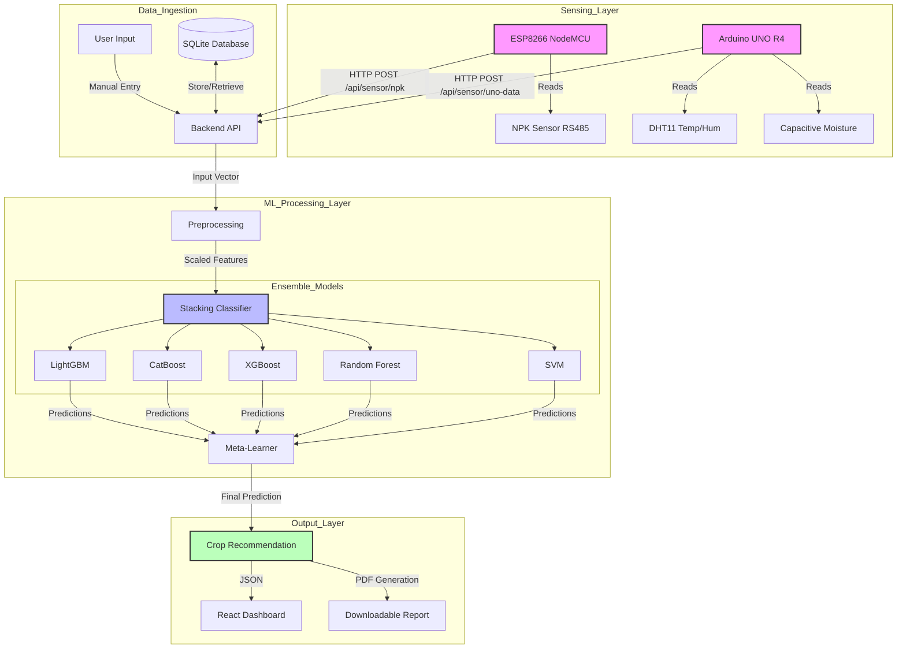

# Model Methodology & Architecture Flow

This document outlines the end-to-end data flow and architecture of the Soil Crop Recommender System, detailing how data is collected, processed, and utilized by the machine learning ensemble to generate crop predictions.

## Architecture Overview

The system follows a **Layered Architecture**:
1.  **Sensing Layer**: IoT devices collect raw environmental and soil data.
2.  **Data Ingestion Layer**: FastAPI backend receives and validates data.
3.  **Machine Learning Layer**: A Stacking Ensemble model processes inputs to predict the optimal crop.
4.  **Application Layer**: React frontend displays insights and reports.

## Data Flow Diagram

## Detailed Methodology

### 1. Data Collection (Inputs)
The model relies on 7 key features:
*   **Nitrogen (N)**: Measured by NPK Sensor (via ESP8266).
*   **Phosphorus (P)**: Measured by NPK Sensor (via ESP8266).
*   **Potassium (K)**: Measured by NPK Sensor (via ESP8266).
*   **Temperature**: Measured by DHT11 (via Arduino UNO).
*   **Humidity**: Measured by DHT11 (via Arduino UNO).
*   **Moisture**: Measured by Capacitive Sensor (via Arduino UNO). (Note: Often mapped to Rainfall or used as a direct feature depending on model training).
*   **pH**: Currently manual input or static value (can be integrated with pH sensor).

### 2. Data Preprocessing
Before feeding data into the models, the backend performs:
*   **Validation**: Pydantic models ensure data types and ranges are correct.
*   **Scaling**: Features are standardized (e.g., using `StandardScaler`) if required by specific base models like SVM. Tree-based models (RF, XGBoost) are generally robust to unscaled data.

### 3. The Stacking Ensemble
We use a **Stacking Classifier** to maximize prediction accuracy. This approach combines the strengths of multiple diverse algorithms:

*   **Base Learners (Level 0)**:
    *   **Random Forest**: Good for capturing non-linear relationships and interactions.
    *   **XGBoost / LightGBM / CatBoost**: Gradient boosting machines that excel at structured tabular data and handle feature importance well.
    *   **SVM**: Effective for high-dimensional spaces (if applicable).
*   **Meta-Learner (Level 1)**:
    *   Typically a **Logistic Regression** model.
    *   It takes the probability outputs (predictions) from all Base Learners as input features.
    *   It learns how to best weigh the base models' decisions to produce the final crop prediction.

### 4. Inference & Output
1.  **Trigger**: User clicks "Predict" on the dashboard.
2.  **Aggregation**: The backend fetches the latest sensor readings from the database and combines them with any manual user inputs (e.g., location, land size).
3.  **Prediction**: The input vector `[N, P, K, Temp, Hum, pH, Rainfall]` is passed to the loaded `StackingClassifier`.
4.  **Result**: The model returns the predicted crop class (e.g., "Rice", "Coffee") and a confidence score.
5.  **Action**: The frontend displays the result, and a PDF report is generated containing the recommendation and agronomic advice.
