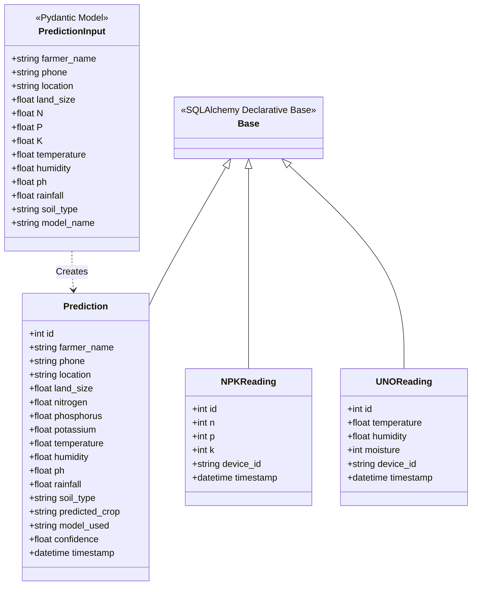
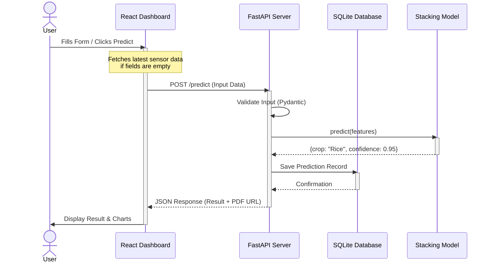
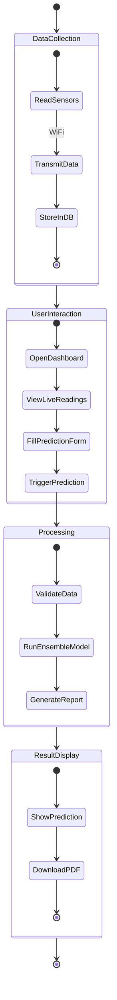
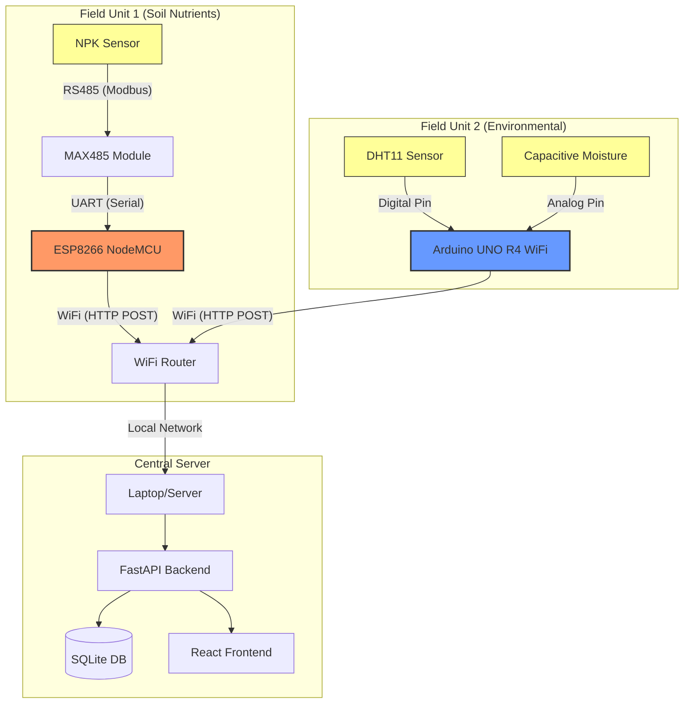

# System Diagrams

This document contains the architectural diagrams for the Soil Crop Recommender System, illustrating the structure, behavior, and hardware connections.

## 1. Class Diagram (Backend Models)

This diagram represents the core data structures used in the FastAPI backend, including database models (SQLAlchemy) and data transfer objects (Pydantic).

## 2. Sequence Diagram (Prediction Flow)

This diagram illustrates the sequence of interactions when a user requests a crop prediction.

## 3. Activity Diagram (System Workflow)

This diagram shows the overall workflow of the system, from data collection to final report generation.

## 4. IoT Hardware Block Diagram

This diagram visualizes the physical connections and communication protocols between the hardware components.

